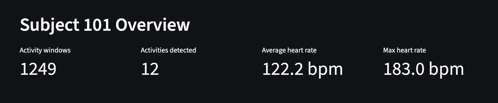

# AthleteIQ

AthleteIQ is a local AI sport performance proof of concept built to demonstrate how wearable movement data, heart-rate data, machine learning, and local language models can support sport science and human performance analysis.

## Project Purpose

This project was created as an applied AI demonstration for graduate study preparation in AI, sport science, movement science, and human performance.

The goal is to show how raw wearable sensor data can be transformed into useful information for coaches, researchers, and performance professionals.

## What AthleteIQ Does

AthleteIQ:

- Loads wearable sensor and heart-rate data
- Cleans and organizes the dataset
- Creates activity windows from raw movement data
- Trains a machine-learning model to classify physical activity
- Displays results in a Streamlit dashboard
- Uses a local Ollama language model to generate a plain-English sport science summary

## Dataset

This project uses the PAMAP2 Physical Activity Monitoring dataset.

The dataset includes movement sensor and heart-rate data from subjects performing multiple physical activities such as walking, running, cycling, sitting, standing, and stair climbing.

## Machine Learning Workflow

The workflow includes:

1. Data loading
2. Data cleaning
3. Missing value handling
4. Feature engineering
5. Activity classification
6. Model evaluation
7. Dashboard visualization
8. Local AI-generated interpretation

## Technologies Used

- Python
- pandas
- scikit-learn
- matplotlib
- Streamlit
- Ollama
- qwen3:4b local language model
- Git

## Local AI Component

AthleteIQ uses Ollama to run a local language model on a Mac mini. The dashboard sends a structured summary of activity and heart-rate results to the local model, which generates a coach-facing interpretation.

This demonstrates a privacy-conscious workflow where data analysis and AI summarization can happen locally without relying on a subscription-based cloud AI model.

## Important Limitations

AthleteIQ is a proof of concept.

It is not a medical device. It does not diagnose injury, prescribe training, or replace professional judgment. The AI summary is intended to support interpretation, not make clinical or medical decisions.

## Relevance to Graduate Study

This project connects directly to:

- AI for sport and movement science
- Applied sport science
- Human performance assessment
- Wearable data analysis
- Research methods
- Machine learning
- Data interpretation
- Coach-friendly communication

## Future Improvements

Possible next steps include:

- Add training load metrics
- Add subject-specific baselines
- Compare multiple machine-learning models
- Add confusion matrix visualizations
- Add feature importance charts
- Add PDF report export
- Add wellness or recovery inputs
- Build a cleaner admissions demo version

## Screenshot

